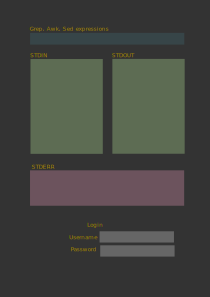
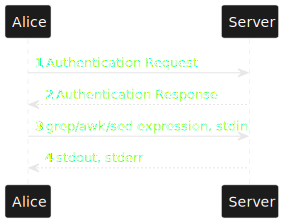

# Grep Awk Sed Repl

## Description deliverable

### Elevator pitch

Have you ever needed to find points of interest in a 5000 line error file, or wanted to fix someone else's formatting in a hundred different files? Do you not know how to create a test file? A Read Evaluate Print Loop for the excellent GNU tools Grep, Awk, and Sed allows you to cook up your very own BASH pipeline of horror, er, utility! Easily provide your own STDIN, write and revise your pipeline until STDOUT looks right and the commands look wrong (morally)!

### Design
I prefer login to be optional, and not to dominate the page.

This sequence diagram shows how Alice might sign in and start writing grep, awk, and sed commands. I may update it as I figure out how the backend works.

### Key features

- Secure login over HTTPS
- Ability to chain grep, awk, and sed by piping
- Display of stdout, stderr
- Ability to save stdin and commands written, publicly or privately
- Visibility of public commands from other users

### Technologies

I am going to use the required technologies in the following ways.

- **HTML** - Plain and clear structure of the page, one page for log in and repl, a second to browse saved commands.
- **CSS** - Application styling that looks good, but is minimal. Good whitespace, plain color choice and contrast.
- **JavaScript** - Provides login, hides login once complete, possible linting, backend endpoint calls (what are those?).
- **Service** - Backend service with endpoints for:
  - login and registration
  - saving commands and stdin
  - retrieving saved commands and stdin
- **DB** - Store users, commands, and stdin in database.
- **Login** - Register and login users. Credentials securely stored in database. Guest users welcome.
- **WebSocket** - Record length command is broadcast to other users.
- **React** - Application ported to use the React web framework.
- **caddy-cgi** - To run gnu grep, awk, and sed. See the [GitHub](https://github.com/aksdb/caddy-cgi).

## HTML deliverable

For this deliverable I added the application structure.

- **HTML pages** - Two HTML pages, one providing the repl, the other saved data.
- **Links** - The repl page has a button to go to the saved page, and so the other way.
- **Text** - The fields are all labeled, as descriptions and filler where appropriate.
- **Images** - I made myself a logo, see the top of the page.
- **Login** - Input box and submit button for login.
- **Database** - The 'saved' page is where the data would show up. Hit the button 'Go to saved'.
- **WebSocket** - The Websocket Alert Area is where notifications will pop up when a new longest command is saved.

## CSS deliverable

For this deliverable I properly styled the application into its final appearance.

- **Header, footer, and main content body** - Footer has name and repo link, header has logo and login, body has the repl.
- **Navigation elements** - At the bottom of each page, a link to the other exists. Should I move these?
- **Responsive to window resizing** - Resizes great horizontally. Resizes pretty well vertically, works fine on mobile.
- **Application elements** - I think I spaced things out well. I'm pleased with the contrast and colors. I abhor bright websites.
- **Application text content** - Consistent fonts, excepting the logo.
- **Application images** - Much better positioned now, just wish it would shrink smaller on mobile.

## JavaScript deliverable

For this deliverable I made my application functional to track and display a user's three votes.

- **login** - When you press click the login button it updates the currently logged in user and enables websocket updates.
- **database** - Sadly, not implemented.
- **WebSocket** - I used the setInterval function to periodically increase the record command length. This will be replaced with WebSocket messages later.
- **application logic** - The application needs run commands in bash on the server. I can make this work with Node, but apparently not in the browser, due to dependencies. I'm looking into what additional backend work might be necessary.

## Service deliverable

For this deliverable I created an HTTP service to host my frontend and provide backend endpoints.

- **Node.js/Express HTTP service** - done!
- **Static middleware for frontend** - done!
- **Calls to third party endpoints** - I put a Chuck Norris joke in since we have to do this.
- **Backend service endpoints** - Can submit cmdset queries, save cmdsets, and browse saved cmdsets.
- **Frontend calls service endpoints** - Various events cause a fetch request to the endpoints.

## DB deliverable

For this deliverable I stored and retrieved data from MongoDB.

- **MongoDB Atlas database created** - done!
- **Endpoints for data** - data is now actually sent to and got from Mongo instead of RAM.
- **Stores data in MongoDB** - done!

## Login deliverable

For this deliverable I added user registration and authentication.

- **User registration** - Creates a new account in the database.
- **existing user** - Verifies the user's name and password from data stored in the database
- **Use MongoDB to store credentials** - done!
- **Restricts functionality** - You cannot see websocket updates until you have logged in. Maybe later saving a command will require login, but that's WIP.

## WebSocket deliverable

For this deliverable I enabled realtime reporting of saved command length from authorized users.

- **Backend listens for WebSocket connection** - done!
- **Frontend makes WebSocket connection** - done!
- **Data sent over WebSocket connection** - done!
- **WebSocket data displayed** - Saved command length updates in realtime (near login area).
